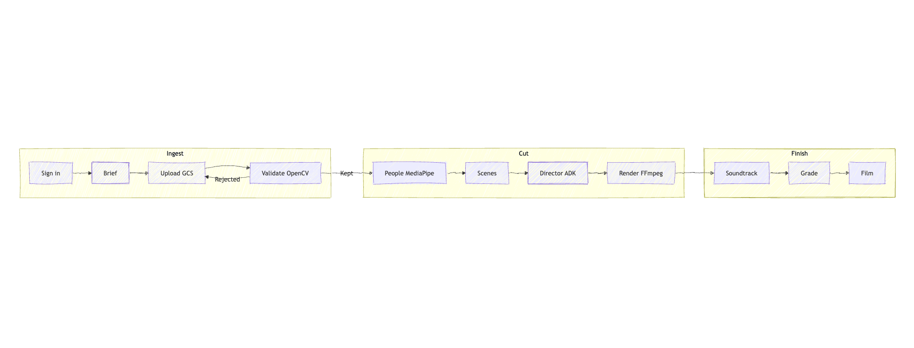
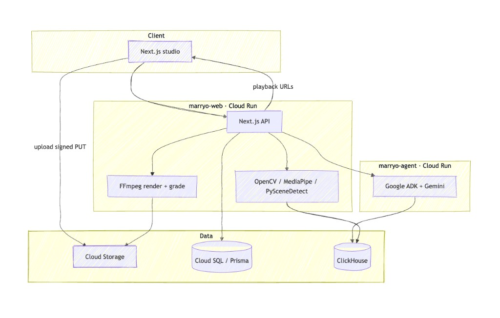
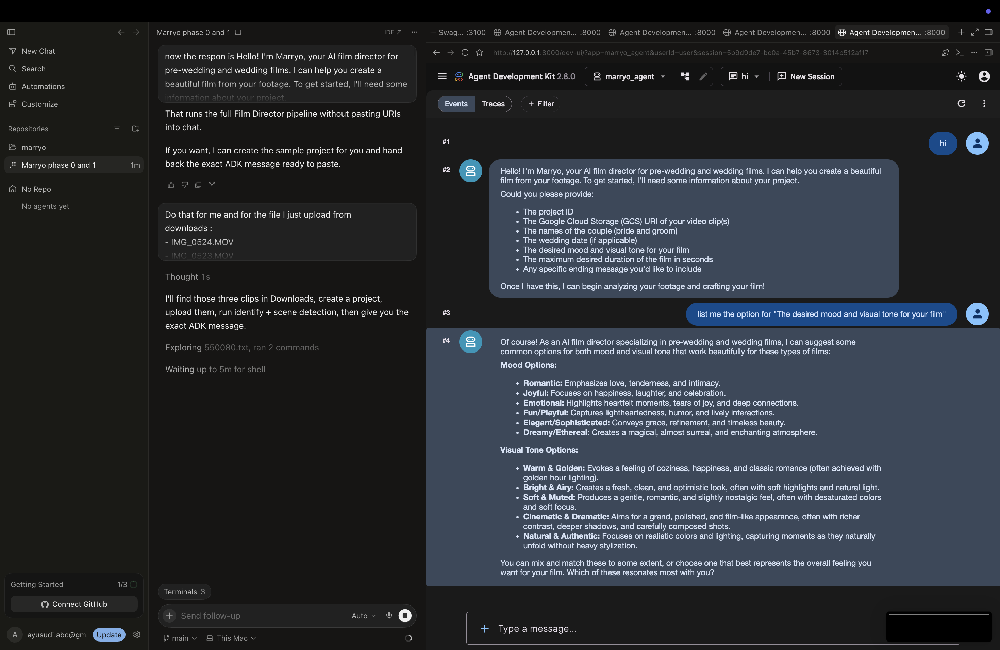
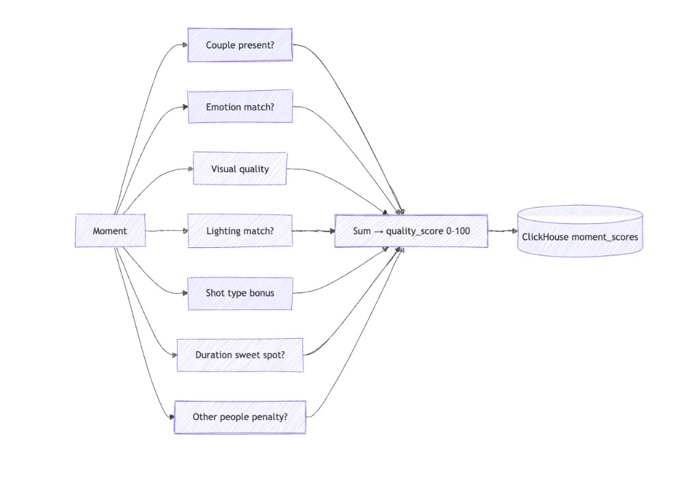
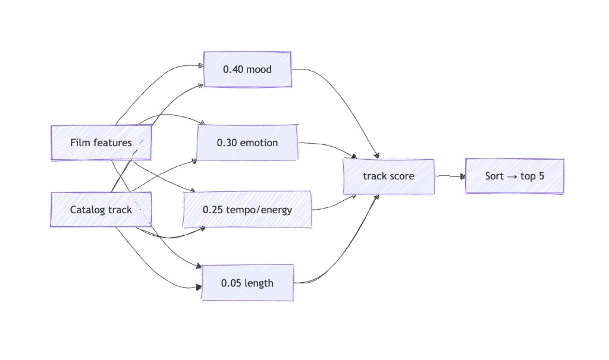
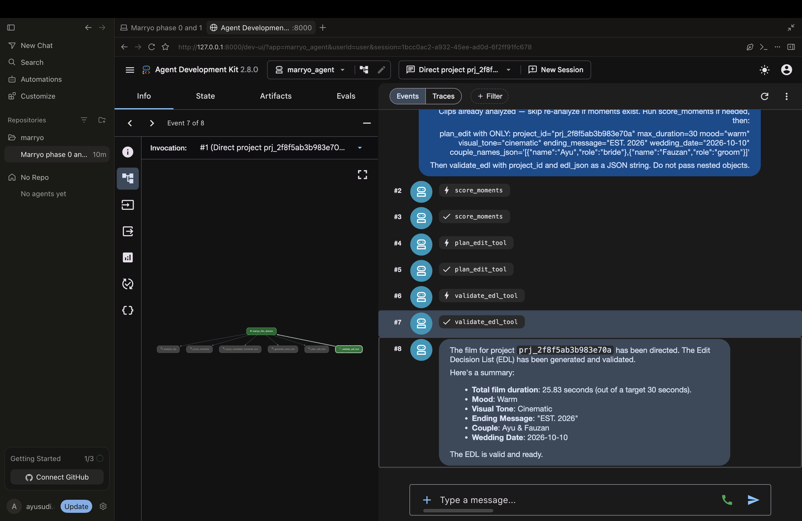

# Marryo — Devpost project story

**Tagline:** *You live the moments. We’ll turn them into your story.*

Live studio: [https://marryo.ayusudi.com](https://marryo.ayusudi.com) · Agent: [https://ai-marryo.ayusudi.com](https://ai-marryo.ayusudi.com)

---

## Inspiration

We built Marryo while preparing for our own wedding — Ayu & Fauzan.

We wanted a pre-wedding film for our digital invitation: little moments from the shoot, the excitement before the day, and everything leading up to it. Once we sat down with the footage, the reality hit — hours of scrubbing timelines, picking moments, shaping a story, and grading. We didn’t want our wedding journey spent in an editing suite.

We wanted to be present. Capture the day. Still walk away with something worth keeping.

That’s the spark: **you live the moments; Marryo turns them into your story.**

---

## What it does

Marryo is an AI pre-wedding **short film** studio. Couples upload a focused set of clips (up to 6), and Marryo produces a story cut with soundtrack and color grade — aimed at about a minute after upload.

**Studio flow**

1. **Footage** — upload and validate clips (container, brightness, sharpness, faces); only Kept clips continue
2. **People** — MediaPipe face clusters; optional bride / groom labels
3. **Direct** — scenes → moment scores → Film Director EDL → FFmpeg picture lock
4. **Sound** — five scored catalog tracks, mute, or original (preview freely, then save)
5. **Grade** — compare before / after color grade, confirm
6. **Short film** — preview and download retained cuts

You leave with a picture-locked short film — portrait or landscape — without opening a timeline.

---

## How we built it

Marryo is an **agentic pipeline**, not a single chat box.

| Layer | Stack |
|-------|--------|
| Studio UI + API | Next.js, React, Tailwind, Auth.js (Google Sign-In) |
| Shared domain | TypeScript services (`@marryo/services`), Prisma + Cloud SQL (Postgres) |
| Film Director | Python Google ADK agent + tool functions |
| Vision / CV | OpenCV, MediaPipe, PySceneDetect, FFmpeg |
| Understanding | Gemini via Vertex AI |
| Moment analytics | ClickHouse + MCP Database Toolbox |
| Media | Google Cloud Storage (signed browser uploads) |
| Delivery | FFmpeg (normalize → stitch → grade → soundtrack remux) |
| Hosting | Cloud Run (`marryo-web` + `marryo-agent`), Secret Manager, Artifact Registry |

The Next.js API orchestrates the studio. The ADK agent owns storytelling: analyze clips, score moments, plan the edit, validate the EDL. Deterministic CV and FFmpeg handle the hard media work so the model doesn’t invent cuts it can’t render.

We optimized Direct → soundtrack for roughly **&lt;1 minute**: clip caps, parallel scene detect/analyze, shared clip cache, parallel normalize + remux, and draft-friendly encode settings.

### Building with Cursor + ADK

We developed the stack in Cursor (agentic coding, repo workflows, Cloud Run deploys) while iterating on the Film Director in the Google ADK web UI — briefing mood/tone options, then running tool traces end-to-end.

---

## How scoring works

Two deterministic score engines sit between “creative” and “renderable.”

### Moment scoring (Direct)

Each analyzed moment gets a **quality_score (0–100)** from theme weights in `scoring.json` (romantic / cinematic / fun): couple presence, emotion match, visual quality, lighting, shot type, duration sweet spot, and an other-people penalty. Scores land in ClickHouse; the Film Director prefers higher moments for the EDL.

### Soundtrack scoring (Sound)

After the picture lock, catalog tracks are ranked against the cut:

**0.40·mood + 0.30·emotion + 0.25·tempo/energy + 0.05·length → top 5**

### Color grading (Grade)

FFmpeg applies `visual_tone` then `mood` filters from `render_presets.json`, and keeps an **ungraded twin** so couples can compare before / after before confirming.

---

## The Film Director in action

The ADK agent (`marryo_agent`) runs tools such as `score_moments` → `plan_edit` → `validate_edl`, then returns a validated EDL for a real project (couple, mood, visual tone, target duration).

Example outcome from a warm / cinematic brief: ~26s cut against a 30s target, ending card copy, EDL marked valid and ready to render.

---

## Challenges we ran into

- **Agent vs. reality** — LLMs love ambitious edits; FFmpeg needs a valid EDL. Validation and scoring had to sit between “creative” and “renderable.”
- **Latency** — early runs took 5+ minutes. Gemini, scene detection, and serial FFmpeg stacked. We cut scope (6 clips), parallelized, cached materialization, and folded grade into the stitch.
- **Orientation** — users chose portrait but got landscape pillars until render and player aspect were aligned end-to-end.
- **Soundtrack UX** — auto-picking music felt wrong; couples need a deliberate choice among catalog / mute / original.
- **Retention** — session end must keep the meaningful three videos (ungraded, graded muted, selected) and drop the rest without surprising users.
- **Split runtime** — TypeScript studio + Python agent + ClickHouse + GCS means many moving parts to keep healthy locally and in production.
- **Waiting UX** — long silent gates fought the “AI shortcut” story; we added phase visibility, clip posters, and fewer clicks on the happy path.

---

## Accomplishments that we're proud of

- An end-to-end studio: footage → people → Direct → sound → grade → short film
- A real Film Director agent on Google ADK with tools for analyze, score, story, plan, and validate
- ClickHouse-backed moment ranking exposed to the agent via MCP
- Sub-minute Direct→soundtrack path on capped footage (with Gemini still in the loop)
- Portrait/landscape-aware render and playback
- A clear product voice: tutorial, about, **pipeline** (scoring + grade), and tech stack that match what the system actually does
- Production on GCP: Cloud Run web + agent, GCS signed uploads, Cloud SQL, Vertex AI, custom domains
- Session hygiene: keep the short film the user chose; don’t hoard every remux forever

---

## What we learned

- Agentic cinema works best when the agent **plans** and deterministic tools **execute**
- Media pipelines fail on the boring edges: aspect ratio, audio mux, cache locality, timeouts
- Latency is a product feature — couples won’t wait for a “smart” edit that feels like overnight batch
- Caps beat cleverness: fewer clips + parallel work beats unbounded footage + hope
- UX after the AI matters: soundtrack choice and grade confirmation are part of authorship, not afterthoughts
- Naming matters: calling the deliverable a **short film** is more honest than “film” for a 30–90s cut

---

## What's next for Marryo

- Stronger identity and couple-aware storytelling across longer shoots
- Richer music matching and licensed catalogs beyond the Mixkit starter set
- Optional longer “ceremony day” modes with clearer time budgets
- Background jobs + status polling so waits feel as fast as they are
- Shareable invitation-ready exports and public gallery polish
- Vertex AI Agent Engine hosting for the Film Director at larger scale

---

## Team / contributors

| Name | Role | Links |
|------|------|--------|
| **Ayu Sudi Dwijayanti** | Co-builder | [GitHub](https://github.com/ayusudi) · [LinkedIn](https://www.linkedin.com/in/ayusudi/) |
| **Muhammad Fauzan** | Co-builder | [GitHub](https://github.com/mfzn) · [LinkedIn](https://www.linkedin.com/in/muhammad-fauzan-8b936a186/) |

---

## Diagram index

| File | Description |
|------|-------------|
| [`images/ingest-cut-finish.png`](images/ingest-cut-finish.png) | Studio pipeline: Ingest → Cut → Finish |
| [`images/architecture.png`](images/architecture.png) | Client, Cloud Run web/agent, data stores |
| [`images/moment-scoring.png`](images/moment-scoring.png) | Moment quality_score breakdown |
| [`images/soundtrack-scoring.png`](images/soundtrack-scoring.png) | Soundtrack weighted ranking |
| [`images/dev-cursor-and-adk.png`](images/dev-cursor-and-adk.png) | Cursor + ADK local development |
| [`images/adk-director-edl.png`](images/adk-director-edl.png) | ADK tool trace and directed EDL |
